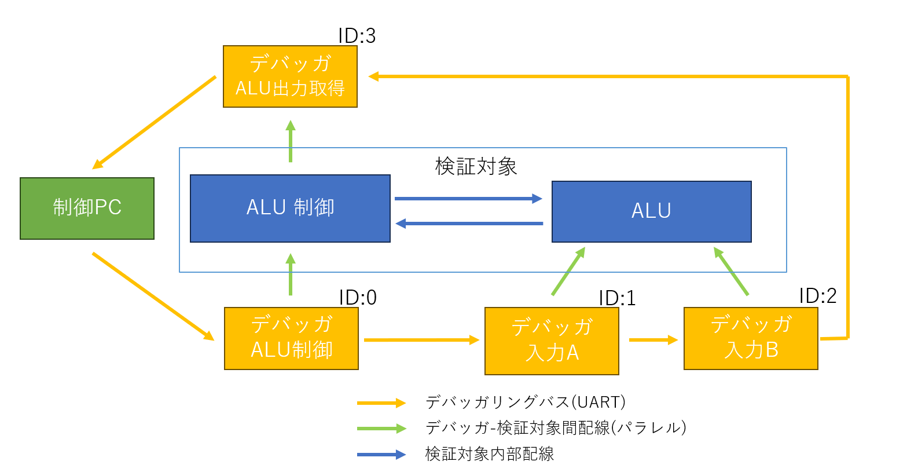

# ALUテスト  

ALUハードウェアの自動テストを行います．

## ハードウェア構成

  

# 実行シーケンス

```
内容                    :   コマンド        :   レスポンス(期待する値)
----------------------------------------------------------------------
全体設定
全体リセット            :   FE-0F-0000      :   FE-0F-0000
デバイス認識            :   FE-00-0000      :   FE-00-0004

状態取得(全デバッガに対して繰り返し)
入出力方向取得          :   (ID)-01-0000    :   FF-01-0000
入力状態取得            :   (ID)-04-0000    :   FF-04-(現在の入力状態)
出力状態取得            :   (ID)-05-0000    :   FF-05-0000


入出力設定
ALU制御入出力設定       :   00-02-0FFF      :   FF-02-0FFF
入力A入出力設定         :   01-02-FFFF      :   FF-02-FFFF
入力B入出力設定         :   02-02-FFFF      :   FF-02-FFFF
ALU出力入出力設定       :   03-02-0000      :   FF-02-0000

テスト(ファンクション，値を変更し繰り返し)
ALUテスト機能設定       :   00-03-(機能)    :   FF-03-(機能)
入力Aテスト値設定       :   01-03-(値)      :   FF-03-(値)
入力Bテスト値設定       :   02-03-(値)      :   FF-03-(値)
ALU出力取得             :   03-04-0000      :   FF-04-(正常な演算結果)
```

## テスト機能

・A<<1  
・A>>1  
・A+B  
・A-B  
・A & B  
・A | B  
・A ^ B  
・A  
・~A  
・A + 1  
・A - 1

main.py内のFuncに追記すれば他の命令もテスト可能．